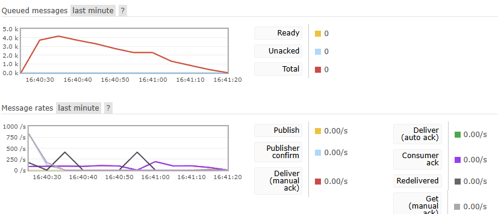
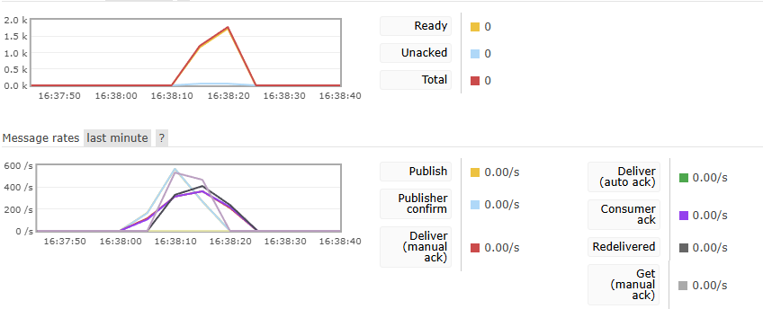

# Order System

## 專案介紹

本專案是一個以 FastAPI 實作的電商訂單系統，支援商品管理、庫存管理與非同步下單流程，目標是在高併發下兼顧吞吐量與庫存一致性。

### 主要功能

- 商品 CRUD（`/products`）
- 庫存查詢與調整（`/inventory`）
- 訂單建立與狀態管理（`/orders`）
- 下單流程採非同步架構：
  - API 先在 Redis 以 Lua script 原子預扣庫存
  - 預扣成功後送出 RabbitMQ 訊息
  - Worker 消費訊息後寫入 PostgreSQL 並完成最終扣庫存

### 技術棧

- API：FastAPI
- Database：PostgreSQL
- ORM：SQLAlchemy (async)
- Cache：Redis（含 Lua script）
- Queue：RabbitMQ（aio-pika）
- Load Test：k6
- Container：Docker Compose

## 系統架構

### 元件與職責

- `api`：提供商品/庫存/訂單 API，負責預扣庫存與送出下單訊息
- `redis`：儲存庫存快取（`stock:product:{id}`），提供原子庫存預扣
- `rabbitmq`：承接下單訊息佇列（預設 `order.create`）
- `worker`：消費訂單訊息，建立訂單並更新 DB，失敗時執行補償
- `db`：作為最終資料來源（source of truth）

### 訂單處理流程

1. Client 呼叫 `POST /orders`
2. API 以 Redis Lua script 進行庫存檢查與預扣
3. 成功後將訂單訊息送入 RabbitMQ，回傳 `202 queued`
4. Worker 消費訊息，於 PostgreSQL 建立訂單與扣減庫存
5. 若 worker 失敗，執行 Redis 庫存回補

### 架構圖

```mermaid
flowchart LR
    graph LR
    C[Client] --> API[FastAPI API]
    
    subgraph Cache_Layer
        R[(Redis)]
    end

    subgraph Messaging
        MQ[(RabbitMQ)]
    end

    subgraph Storage
        DB[(PostgreSQL)]
    end

    API -->|1. Reserve Stock| R
    API -->|2. Publish Message| MQ
    MQ -->|3. Consume| W[Order Worker]
    W -->|4. Persist Data| DB
    W -.->|5. Rollback / Compensation| R
```

### 啟動方式

```bash
docker compose up -d --build db redis rabbitmq api worker
```

執行 k6（loadtest profile）：

```bash
docker compose --profile loadtest up -d --build k6
# 或
docker compose run --rm k6
```

## 測試結果

以下結果整理自目前專案文件（`ARCHITECTURE.md`、`record.md`）：

### 負載測試（k6）

- 測試腳本：`tests/k6/order_flow_test.js`
- 條件：10,000 筆下單請求
- 結果：總耗時約 **10 秒**

### 多 worker 吞吐對比（低衝突情境）

- 測試條件：
  - 50 種商品
  - 每種庫存 200
  - 共 5,000 張訂單（每單 2 件商品，共 10,000 件）
- 結果：
  - 1 個 worker：約 60 秒
    
  - 5 個 worker：約 12 秒
    
  - 吞吐量接近 5 倍提升

### 測試結論

- 在低衝突（訂單分散）情境下，增加 worker 有明顯擴展效益。
- 在高衝突（集中搶單同商品）情境下，樂觀鎖衝突會提高，吞吐可能下降，需搭配重試與補償策略。

---
